# 🤖 Multi-Agent AI Interview Platform

### An AI-Powered Interview Preparation & Career Guidance Platform

A full-stack, microservices-based AI interview platform that helps candidates prepare for technical and HR interviews through specialized AI agents. It provides intelligent resume analysis, personalized mock interviews, AI-powered performance evaluation, and customized learning roadmaps.

Built using the MERN stack, LangChain, LangGraph, Redis, MongoDB, and Docker.

---

## 🌟 Key Features

- **🧠 AI Interview Agent:** Conducts personalized technical and HR mock interviews based on the candidate's target role.
- **📄 Resume Analysis Agent:** Analyzes uploaded resumes and extracts skills, experience, and areas for improvement.
- **📊 AI Feedback Agent:** Evaluates interview responses and provides structured feedback, strengths, weaknesses, and improvement suggestions.
- **🎯 Roadmap Agent:** Generates personalized learning roadmaps based on interview performance and skill gaps.
- **🔐 Authentication:** Secure user authentication and account management using Firebase Authentication.
- **💳 Credit & Payment System:** Integrated payment functionality using Razorpay.
- **⚡ Redis Caching:** Improves performance by caching frequently accessed data.
- **📈 User Dashboard:** Provides access to interviews, reports, resume analysis, and learning progress.
- **🏗️ Microservices Architecture:** Independent backend services for modularity, scalability, and maintainability.

---

## 🛠️ Technology Stack

| Category | Technologies |
|---|---|
| Frontend | React.js, JavaScript, CSS |
| Backend | Node.js, Express.js |
| Database | MongoDB |
| Caching | Redis |
| AI Integration | LangChain, LangGraph, Groq LLM |
| Authentication | Firebase Authentication |
| Payments | Razorpay |
| Containerization | Docker |
| Cloud Infrastructure | AWS ECR, ECS, Fargate |
| API Architecture | REST APIs |

---

## 🏗️ System Architecture

The platform follows a microservices architecture in which the frontend communicates with backend services through a centralized API Gateway.

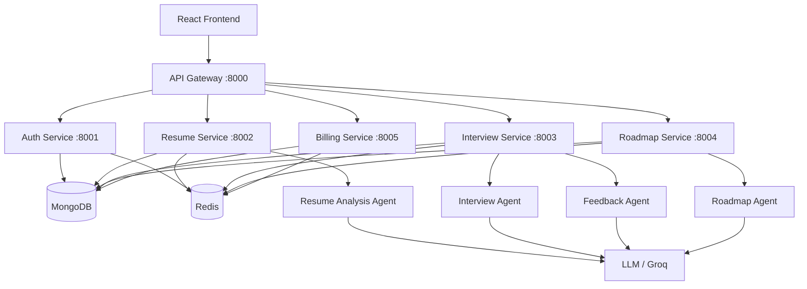
```mermaid
flowchart TD
    A[React Frontend] --> B[API Gateway :8000]

    B --> C[Auth Service :8001]
    B --> D[Resume Service :8002]
    B --> E[Interview Service :8003]
    B --> F[Roadmap Service :8004]
    B --> G[Billing Service :8005]

    C --> H[(MongoDB)]
    D --> H
    E --> H
    F --> H
    G --> H

    C --> I[(Redis)]
    D --> I
    E --> I
    F --> I
    G --> I

    D --> J[Resume Analysis Agent]
    E --> K[Interview Agent]
    E --> L[Feedback Agent]
    F --> M[Roadmap Agent]

    J --> N[LLM / Groq]
    K --> N
    L --> N
    M --> N
```
# 🏗️ Multi.AI – System Architecture & Design

Multi.AI follows a **microservices-based architecture** with AI-powered agents to provide personalized career preparation. The platform consists of independent backend services responsible for authentication, resume analysis, mock interviews, personalized roadmaps, and payment management.

## 📌 Table of Contents

- [System Architecture](#-system-architecture)
- [Application Workflow](#-application-workflow)
- [AI Agent Workflows](#-ai-agent-workflows)
- [Sequence Diagrams](#-sequence-diagrams)
- [Database Design (ER Diagrams)](#-database-design-er-diagrams)
- [UML Diagrams](#-uml-diagrams)
- [Deployment Architecture](#-deployment-architecture)

---

# 🏛️ System Architecture

Multi.AI uses a centralized API Gateway to communicate with independent microservices. Each service handles a specific business responsibility and integrates with the required AI models, databases, and third-party APIs.

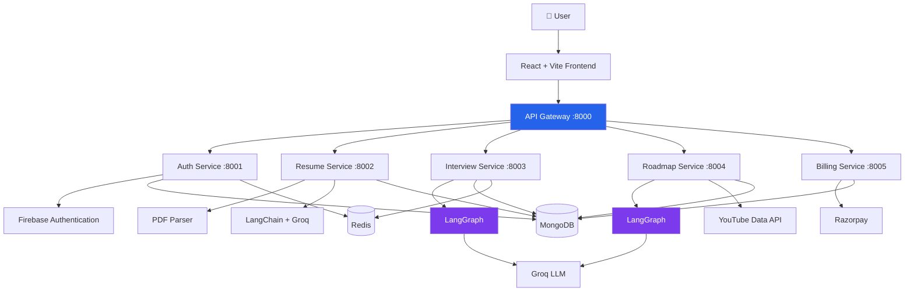
```mermaid
flowchart TB
    U["👤 User"] --> FE["React + Vite Frontend"]
    FE --> GW["API Gateway :8000"]

    GW --> AUTH["Auth Service :8001"]
    GW --> RES["Resume Service :8002"]
    GW --> INT["Interview Service :8003"]
    GW --> ROAD["Roadmap Service :8004"]
    GW --> BILL["Billing Service :8005"]

    AUTH --> FB["Firebase Authentication"]
    RES --> PDF["PDF Parser"]
    RES --> LC["LangChain + Groq"]

    INT --> LG1["LangGraph"]
    ROAD --> LG2["LangGraph"]

    LG1 --> GROQ["Groq LLM"]
    LG2 --> GROQ

    ROAD --> YT["YouTube Data API"]
    BILL --> RZ["Razorpay"]

    AUTH --> DB[("MongoDB")]
    RES --> DB
    INT --> DB
    ROAD --> DB
    BILL --> DB

    AUTH --> REDIS[("Redis")]
    INT --> REDIS

    style GW fill:#2563eb,color:#fff
    style LG1 fill:#7c3aed,color:#fff
    style LG2 fill:#7c3aed,color:#fff
```

### Microservices Overview

| Service | Port | Responsibility |
|---|---:|---|
| API Gateway | 8000 | Centralized routing and authentication middleware |
| Auth Service | 8001 | Google authentication, sessions and user management |
| Resume Service | 8002 | PDF processing and AI-powered resume evaluation |
| Interview Service | 8003 | AI mock interviews and performance evaluation |
| Roadmap Service | 8004 | Personalized learning roadmaps and resources |
| Billing Service | 8005 | Razorpay payments and coin management |

---

# 🔄 Application Workflow

The following diagram represents the complete user journey through the Multi.AI platform.

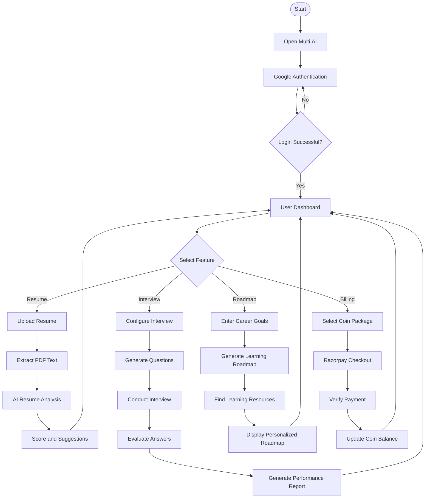
```mermaid
flowchart TD
    A([Start]) --> B["Open Multi.AI"]
    B --> C["Google Authentication"]
    C --> D{"Login Successful?"}

    D -->|No| C
    D -->|Yes| E["User Dashboard"]

    E --> F{"Select Feature"}

    F -->|Resume| R1["Upload Resume"]
    R1 --> R2["Extract PDF Text"]
    R2 --> R3["AI Resume Analysis"]
    R3 --> R4["Score and Suggestions"]
    R4 --> E

    F -->|Interview| I1["Configure Interview"]
    I1 --> I2["Generate Questions"]
    I2 --> I3["Conduct Interview"]
    I3 --> I4["Evaluate Answers"]
    I4 --> I5["Generate Performance Report"]
    I5 --> E

    F -->|Roadmap| M1["Enter Career Goals"]
    M1 --> M2["Generate Learning Roadmap"]
    M2 --> M3["Find Learning Resources"]
    M3 --> M4["Display Personalized Roadmap"]
    M4 --> E

    F -->|Billing| P1["Select Coin Package"]
    P1 --> P2["Razorpay Checkout"]
    P2 --> P3["Verify Payment"]
    P3 --> P4["Update Coin Balance"]
    P4 --> E
```

---

# 🤖 AI Agent Workflows

Multi.AI uses specialized AI workflows to handle different career preparation tasks.

## 1. Resume Scoring Workflow

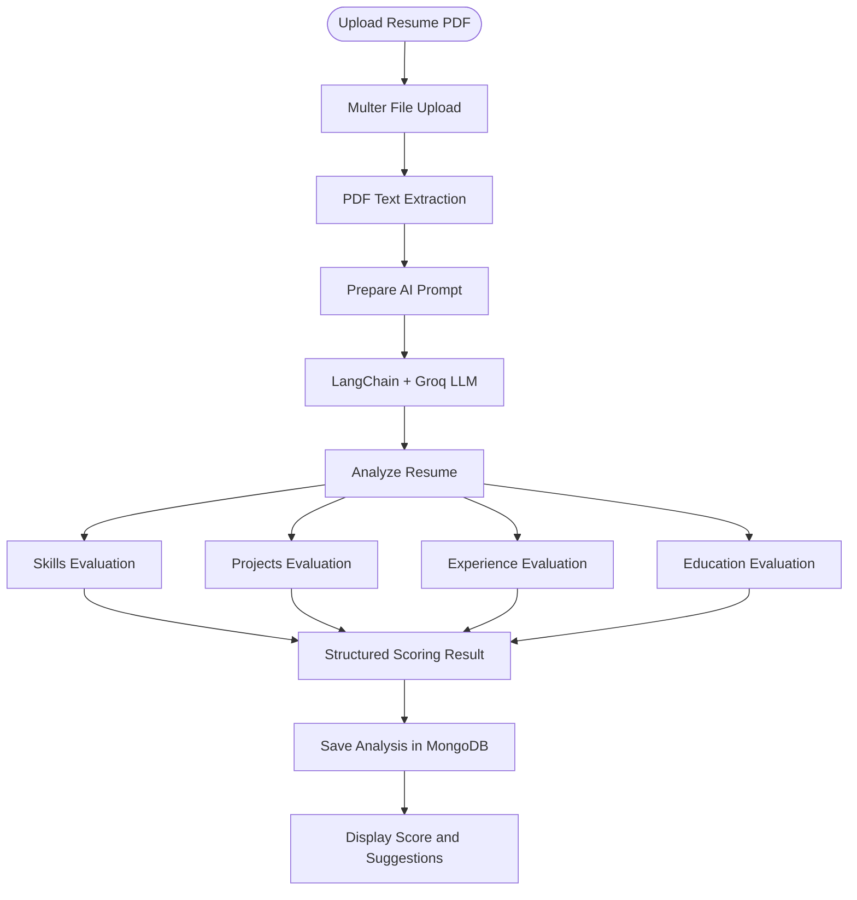
```mermaid
flowchart TD
    A(["Upload Resume PDF"]) --> B["Multer File Upload"]
    B --> C["PDF Text Extraction"]
    C --> D["Prepare AI Prompt"]
    D --> E["LangChain + Groq LLM"]
    E --> F["Analyze Resume"]

    F --> G["Skills Evaluation"]
    F --> H["Projects Evaluation"]
    F --> I["Experience Evaluation"]
    F --> J["Education Evaluation"]

    G --> K["Structured Scoring Result"]
    H --> K
    I --> K
    J --> K

    K --> L["Save Analysis in MongoDB"]
    L --> M["Display Score and Suggestions"]
```

## 2. AI Interview Workflow

The Interview Service uses LangGraph to orchestrate the interview workflow, manage question evaluation, and generate the final performance report.

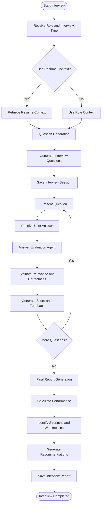
```mermaid
flowchart TD
    A(["Start Interview"]) --> B["Receive Role and Interview Type"]
    B --> C{"Use Resume Context?"}

    C -->|Yes| D["Retrieve Resume Context"]
    C -->|No| E["Use Role Context"]

    D --> F["Question Generation"]
    E --> F

    F --> G["Generate Interview Questions"]
    G --> H["Save Interview Session"]
    H --> I["Present Question"]
    I --> J["Receive User Answer"]

    J --> K["Answer Evaluation Agent"]
    K --> L["Evaluate Relevance and Correctness"]
    L --> M["Generate Score and Feedback"]

    M --> N{"More Questions?"}

    N -->|Yes| I
    N -->|No| O["Final Report Generation"]

    O --> P["Calculate Performance"]
    P --> Q["Identify Strengths and Weaknesses"]
    Q --> R["Generate Recommendations"]
    R --> S["Save Interview Report"]
    S --> T(["Interview Completed"])
```

## 3. Personalized Roadmap Workflow

The Roadmap Service uses two specialized agents:

- **Roadmap Agent:** Generates personalized learning modules based on career goals, salary expectations, and current skill level.
- **Resource Agent:** Finds relevant learning materials and attaches resources to roadmap modules.

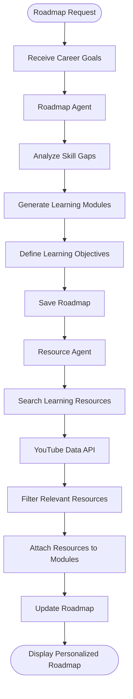
```mermaid
flowchart TD
    A(["Roadmap Request"]) --> B["Receive Career Goals"]
    B --> C["Roadmap Agent"]
    C --> D["Analyze Skill Gaps"]
    D --> E["Generate Learning Modules"]
    E --> F["Define Learning Objectives"]
    F --> G["Save Roadmap"]

    G --> H["Resource Agent"]
    H --> I["Search Learning Resources"]
    I --> J["YouTube Data API"]
    J --> K["Filter Relevant Resources"]
    K --> L["Attach Resources to Modules"]
    L --> M["Update Roadmap"]
    M --> N(["Display Personalized Roadmap"])
```

## 4. Billing and Coin Management Workflow

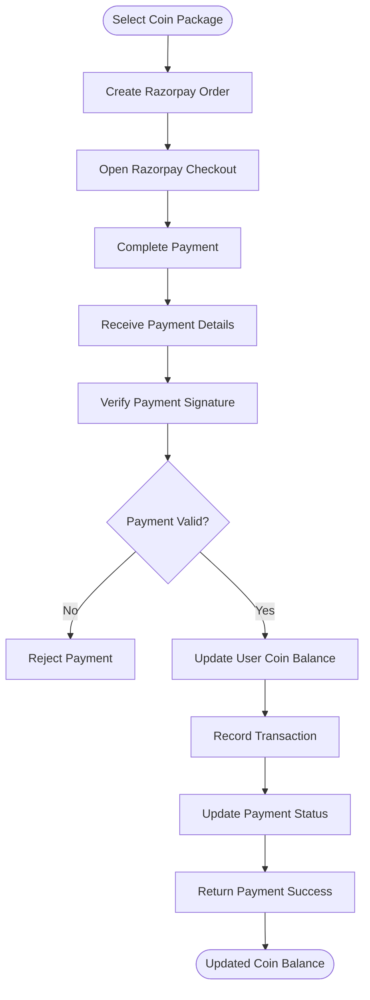
```mermaid
flowchart TD
    A(["Select Coin Package"]) --> B["Create Razorpay Order"]
    B --> C["Open Razorpay Checkout"]
    C --> D["Complete Payment"]
    D --> E["Receive Payment Details"]
    E --> F["Verify Payment Signature"]

    F --> G{"Payment Valid?"}

    G -->|No| H["Reject Payment"]
    G -->|Yes| I["Update User Coin Balance"]

    I --> J["Record Transaction"]
    J --> K["Update Payment Status"]
    K --> L["Return Payment Success"]
    L --> M(["Updated Coin Balance"])
```

---

# 🔁 Sequence Diagrams

Sequence diagrams illustrate the communication between users, frontend, API Gateway, microservices, databases, and external integrations.

<details>
<summary><b>1. Authentication Service Sequence</b></summary>

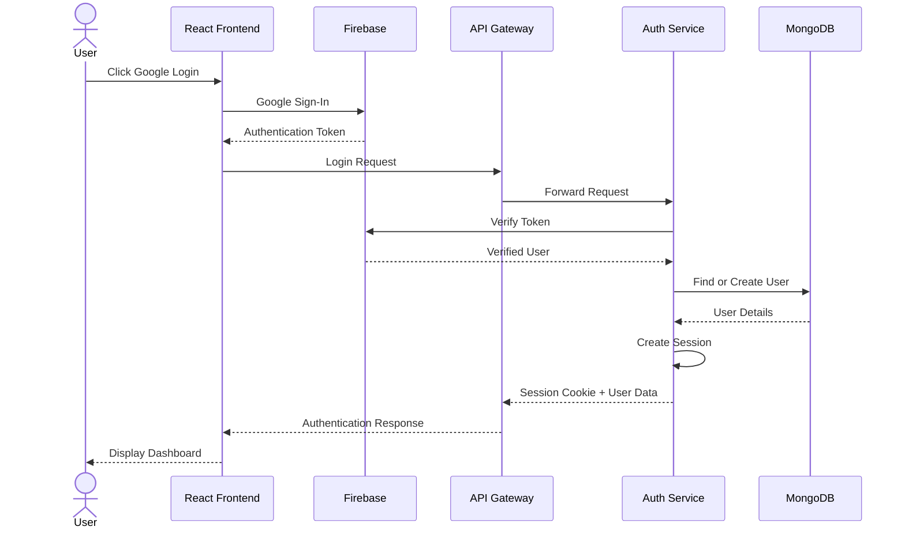
```mermaid
sequenceDiagram
    actor User
    participant FE as React Frontend
    participant FB as Firebase
    participant GW as API Gateway
    participant AUTH as Auth Service
    participant DB as MongoDB

    User->>FE: Click Google Login
    FE->>FB: Google Sign-In
    FB-->>FE: Authentication Token
    FE->>GW: Login Request
    GW->>AUTH: Forward Request
    AUTH->>FB: Verify Token
    FB-->>AUTH: Verified User
    AUTH->>DB: Find or Create User
    DB-->>AUTH: User Details
    AUTH->>AUTH: Create Session
    AUTH-->>GW: Session Cookie + User Data
    GW-->>FE: Authentication Response
    FE-->>User: Display Dashboard
```

</details>

<details>
<summary><b>2. Resume Service Sequence</b></summary>

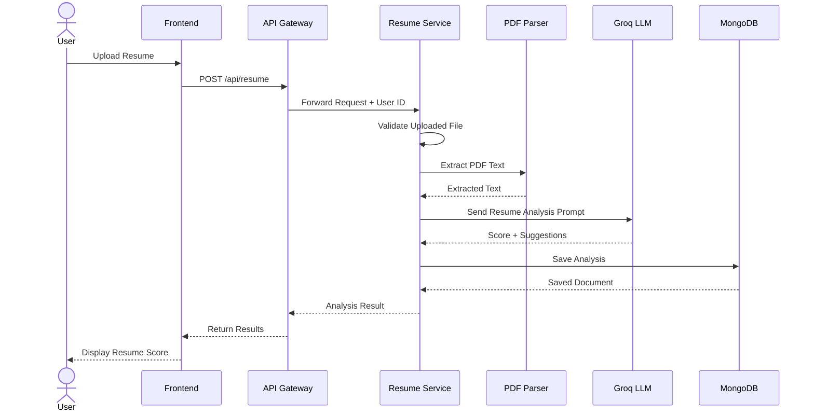
```mermaid
sequenceDiagram
    actor User
    participant FE as Frontend
    participant GW as API Gateway
    participant RES as Resume Service
    participant PDF as PDF Parser
    participant AI as Groq LLM
    participant DB as MongoDB

    User->>FE: Upload Resume
    FE->>GW: POST /api/resume
    GW->>RES: Forward Request + User ID
    RES->>RES: Validate Uploaded File
    RES->>PDF: Extract PDF Text
    PDF-->>RES: Extracted Text
    RES->>AI: Send Resume Analysis Prompt
    AI-->>RES: Score + Suggestions
    RES->>DB: Save Analysis
    DB-->>RES: Saved Document
    RES-->>GW: Analysis Result
    GW-->>FE: Return Results
    FE-->>User: Display Resume Score
```

</details>

<details>
<summary><b>3. Interview Service Sequence</b></summary>

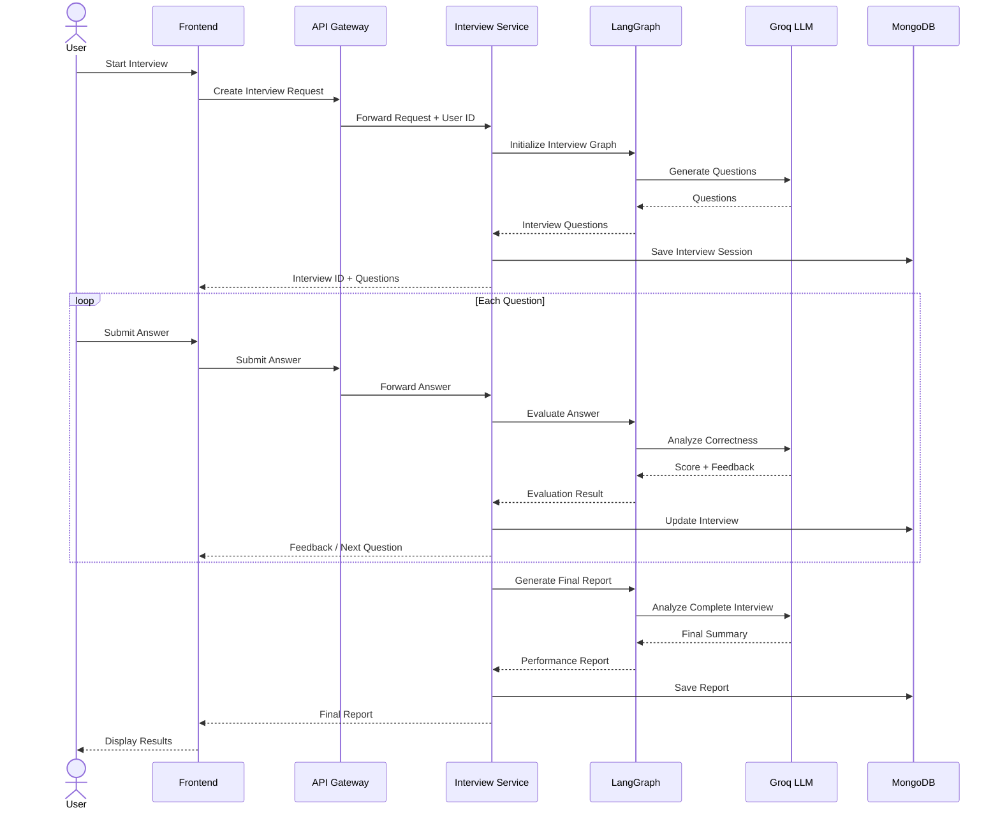
```mermaid
sequenceDiagram
    actor User
    participant FE as Frontend
    participant GW as API Gateway
    participant INT as Interview Service
    participant LG as LangGraph
    participant AI as Groq LLM
    participant DB as MongoDB

    User->>FE: Start Interview
    FE->>GW: Create Interview Request
    GW->>INT: Forward Request + User ID
    INT->>LG: Initialize Interview Graph
    LG->>AI: Generate Questions
    AI-->>LG: Questions
    LG-->>INT: Interview Questions
    INT->>DB: Save Interview Session
    INT-->>FE: Interview ID + Questions

    loop Each Question
        User->>FE: Submit Answer
        FE->>GW: Submit Answer
        GW->>INT: Forward Answer
        INT->>LG: Evaluate Answer
        LG->>AI: Analyze Correctness
        AI-->>LG: Score + Feedback
        LG-->>INT: Evaluation Result
        INT->>DB: Update Interview
        INT-->>FE: Feedback / Next Question
    end

    INT->>LG: Generate Final Report
    LG->>AI: Analyze Complete Interview
    AI-->>LG: Final Summary
    LG-->>INT: Performance Report
    INT->>DB: Save Report
    INT-->>FE: Final Report
    FE-->>User: Display Results
```

</details>

<details>
<summary><b>4. Roadmap Service Sequence</b></summary>

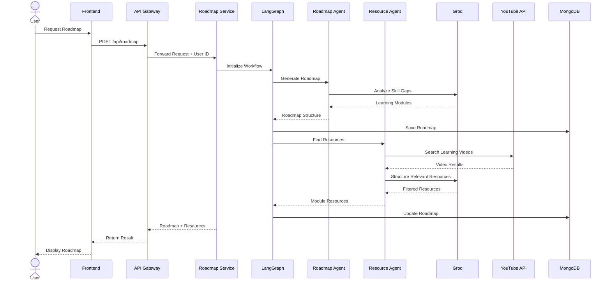
```mermaid
sequenceDiagram
    actor User
    participant FE as Frontend
    participant GW as API Gateway
    participant ROAD as Roadmap Service
    participant LG as LangGraph
    participant RA as Roadmap Agent
    participant RES as Resource Agent
    participant AI as Groq
    participant YT as YouTube API
    participant DB as MongoDB

    User->>FE: Request Roadmap
    FE->>GW: POST /api/roadmap
    GW->>ROAD: Forward Request + User ID
    ROAD->>LG: Initialize Workflow
    LG->>RA: Generate Roadmap
    RA->>AI: Analyze Skill Gaps
    AI-->>RA: Learning Modules
    RA-->>LG: Roadmap Structure
    LG->>DB: Save Roadmap

    LG->>RES: Find Resources
    RES->>YT: Search Learning Videos
    YT-->>RES: Video Results
    RES->>AI: Structure Relevant Resources
    AI-->>RES: Filtered Resources
    RES-->>LG: Module Resources

    LG->>DB: Update Roadmap
    ROAD-->>GW: Roadmap + Resources
    GW-->>FE: Return Result
    FE-->>User: Display Roadmap
```

</details>

<details>
<summary><b>5. Billing Service Sequence</b></summary>

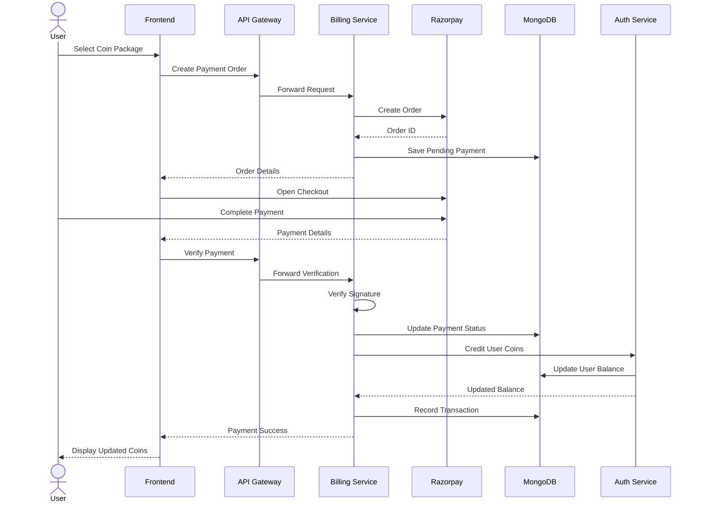
```mermaid
sequenceDiagram
    actor User
    participant FE as Frontend
    participant GW as API Gateway
    participant BILL as Billing Service
    participant RZ as Razorpay
    participant DB as MongoDB
    participant AUTH as Auth Service

    User->>FE: Select Coin Package
    FE->>GW: Create Payment Order
    GW->>BILL: Forward Request
    BILL->>RZ: Create Order
    RZ-->>BILL: Order ID
    BILL->>DB: Save Pending Payment
    BILL-->>FE: Order Details

    FE->>RZ: Open Checkout
    User->>RZ: Complete Payment
    RZ-->>FE: Payment Details
    FE->>GW: Verify Payment
    GW->>BILL: Forward Verification
    BILL->>BILL: Verify Signature
    BILL->>DB: Update Payment Status

    BILL->>AUTH: Credit User Coins
    AUTH->>DB: Update User Balance
    AUTH-->>BILL: Updated Balance
    BILL->>DB: Record Transaction

    BILL-->>FE: Payment Success
    FE-->>User: Display Updated Coins
```

</details>

<details>
<summary><b>6. API Gateway Sequence</b></summary>

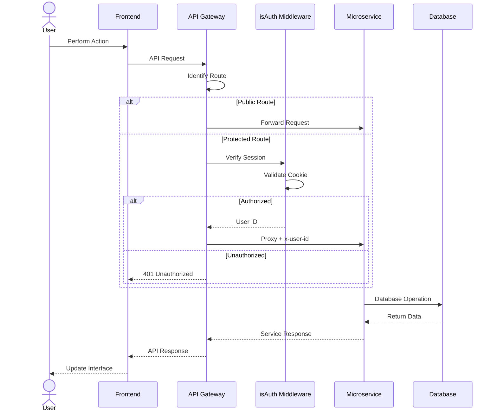
```mermaid
sequenceDiagram
    actor User
    participant FE as Frontend
    participant GW as API Gateway
    participant MW as isAuth Middleware
    participant S as Microservice
    participant DB as Database

    User->>FE: Perform Action
    FE->>GW: API Request
    GW->>GW: Identify Route

    alt Public Route
        GW->>S: Forward Request
    else Protected Route
        GW->>MW: Verify Session
        MW->>MW: Validate Cookie

        alt Authorized
            MW-->>GW: User ID
            GW->>S: Proxy + x-user-id
        else Unauthorized
            GW-->>FE: 401 Unauthorized
        end
    end

    S->>DB: Database Operation
    DB-->>S: Return Data
    S-->>GW: Service Response
    GW-->>FE: API Response
    FE-->>User: Update Interface
```

</details>

---

# 🗄️ Database Design (ER Diagrams)

The following diagrams represent the logical database design of Multi.AI. Actual MongoDB document structures may use embedded arrays and nested objects instead of separate collections.

## Complete System ER Diagram

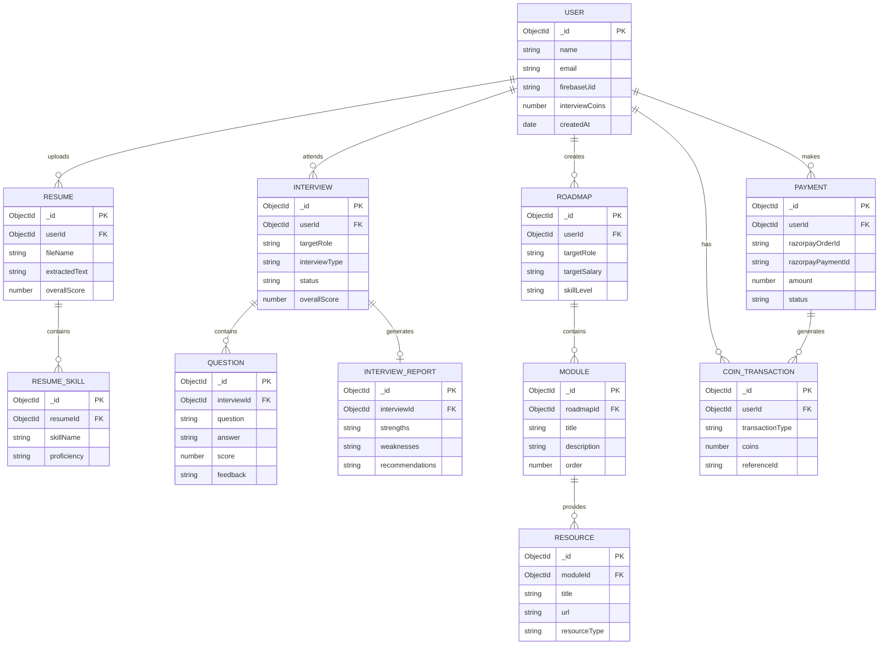
```mermaid
erDiagram
    USER ||--o{ RESUME : uploads
    RESUME ||--o{ RESUME_SKILL : contains
    USER ||--o{ INTERVIEW : attends
    INTERVIEW ||--o{ QUESTION : contains
    INTERVIEW ||--o| INTERVIEW_REPORT : generates
    USER ||--o{ ROADMAP : creates
    ROADMAP ||--o{ MODULE : contains
    MODULE ||--o{ RESOURCE : provides
    USER ||--o{ PAYMENT : makes
    USER ||--o{ COIN_TRANSACTION : has
    PAYMENT ||--o{ COIN_TRANSACTION : generates

    USER {
        ObjectId _id PK
        string name
        string email
        string firebaseUid
        number interviewCoins
        date createdAt
    }

    RESUME {
        ObjectId _id PK
        ObjectId userId FK
        string fileName
        string extractedText
        number overallScore
    }

    RESUME_SKILL {
        ObjectId _id PK
        ObjectId resumeId FK
        string skillName
        string proficiency
    }

    INTERVIEW {
        ObjectId _id PK
        ObjectId userId FK
        string targetRole
        string interviewType
        string status
        number overallScore
    }

    QUESTION {
        ObjectId _id PK
        ObjectId interviewId FK
        string question
        string answer
        number score
        string feedback
    }

    INTERVIEW_REPORT {
        ObjectId _id PK
        ObjectId interviewId FK
        string strengths
        string weaknesses
        string recommendations
    }

    ROADMAP {
        ObjectId _id PK
        ObjectId userId FK
        string targetRole
        string targetSalary
        string skillLevel
    }

    MODULE {
        ObjectId _id PK
        ObjectId roadmapId FK
        string title
        string description
        number order
    }

    RESOURCE {
        ObjectId _id PK
        ObjectId moduleId FK
        string title
        string url
        string resourceType
    }

    PAYMENT {
        ObjectId _id PK
        ObjectId userId FK
        string razorpayOrderId
        string razorpayPaymentId
        number amount
        string status
    }

    COIN_TRANSACTION {
        ObjectId _id PK
        ObjectId userId FK
        string transactionType
        number coins
        string referenceId
    }
```

<details>
<summary><b>Authentication Service ER Diagram</b></summary>

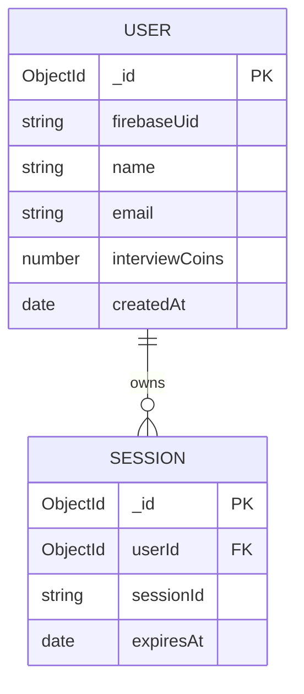
```mermaid
erDiagram
    USER ||--o{ SESSION : owns

    USER {
        ObjectId _id PK
        string firebaseUid
        string name
        string email
        number interviewCoins
        date createdAt
    }

    SESSION {
        ObjectId _id PK
        ObjectId userId FK
        string sessionId
        date expiresAt
    }
```

</details>

<details>
<summary><b>Resume Service ER Diagram</b></summary>

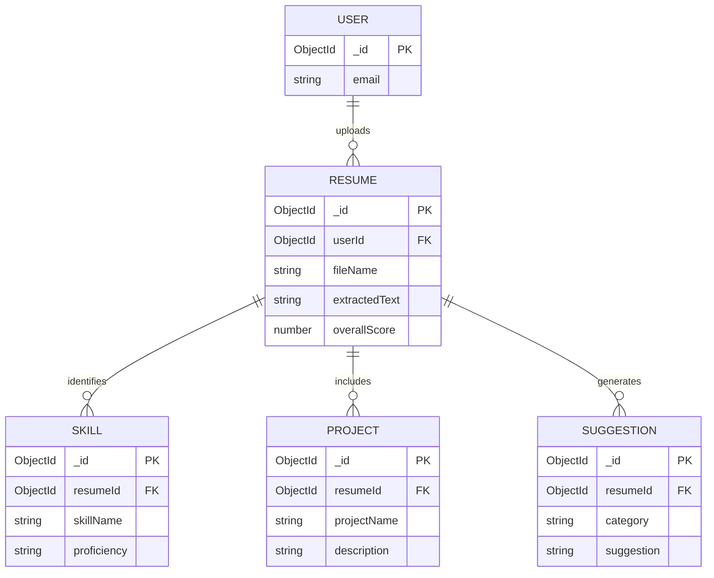
```mermaid
erDiagram
    USER ||--o{ RESUME : uploads
    RESUME ||--o{ SKILL : identifies
    RESUME ||--o{ PROJECT : includes
    RESUME ||--o{ SUGGESTION : generates

    USER {
        ObjectId _id PK
        string email
    }

    RESUME {
        ObjectId _id PK
        ObjectId userId FK
        string fileName
        string extractedText
        number overallScore
    }

    SKILL {
        ObjectId _id PK
        ObjectId resumeId FK
        string skillName
        string proficiency
    }

    PROJECT {
        ObjectId _id PK
        ObjectId resumeId FK
        string projectName
        string description
    }

    SUGGESTION {
        ObjectId _id PK
        ObjectId resumeId FK
        string category
        string suggestion
    }
```

</details>

<details>
<summary><b>Interview Service ER Diagram</b></summary>

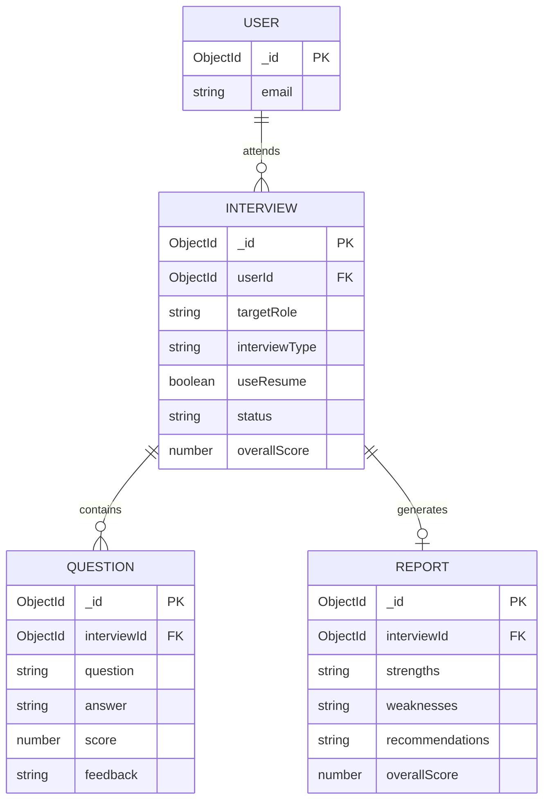
```mermaid
erDiagram
    USER ||--o{ INTERVIEW : attends
    INTERVIEW ||--o{ QUESTION : contains
    INTERVIEW ||--o| REPORT : generates

    USER {
        ObjectId _id PK
        string email
    }

    INTERVIEW {
        ObjectId _id PK
        ObjectId userId FK
        string targetRole
        string interviewType
        boolean useResume
        string status
        number overallScore
    }

    QUESTION {
        ObjectId _id PK
        ObjectId interviewId FK
        string question
        string answer
        number score
        string feedback
    }

    REPORT {
        ObjectId _id PK
        ObjectId interviewId FK
        string strengths
        string weaknesses
        string recommendations
        number overallScore
    }
```

</details>

<details>
<summary><b>Roadmap Service ER Diagram</b></summary>

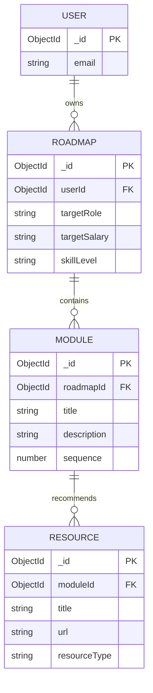
```mermaid
erDiagram
    USER ||--o{ ROADMAP : owns
    ROADMAP ||--o{ MODULE : contains
    MODULE ||--o{ RESOURCE : recommends

    USER {
        ObjectId _id PK
        string email
    }

    ROADMAP {
        ObjectId _id PK
        ObjectId userId FK
        string targetRole
        string targetSalary
        string skillLevel
    }

    MODULE {
        ObjectId _id PK
        ObjectId roadmapId FK
        string title
        string description
        number sequence
    }

    RESOURCE {
        ObjectId _id PK
        ObjectId moduleId FK
        string title
        string url
        string resourceType
    }
```

</details>

<details>
<summary><b>Billing Service ER Diagram</b></summary>

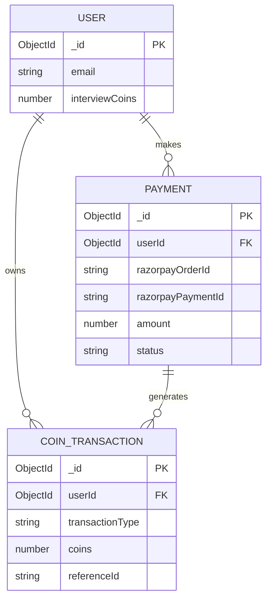
```mermaid
erDiagram
    USER ||--o{ PAYMENT : makes
    USER ||--o{ COIN_TRANSACTION : owns
    PAYMENT ||--o{ COIN_TRANSACTION : generates

    USER {
        ObjectId _id PK
        string email
        number interviewCoins
    }

    PAYMENT {
        ObjectId _id PK
        ObjectId userId FK
        string razorpayOrderId
        string razorpayPaymentId
        number amount
        string status
    }

    COIN_TRANSACTION {
        ObjectId _id PK
        ObjectId userId FK
        string transactionType
        number coins
        string referenceId
    }
```

</details>

---

# 📐 UML Diagrams

## 1. UML Class Diagram

The class diagram represents the core domain objects and their relationships.

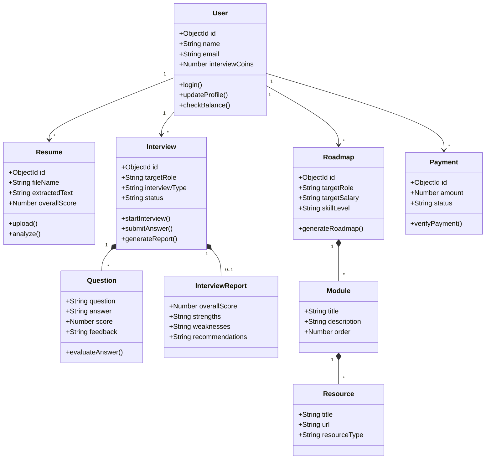
```mermaid
classDiagram
    class User {
        +ObjectId id
        +String name
        +String email
        +Number interviewCoins
        +login()
        +updateProfile()
        +checkBalance()
    }

    class Resume {
        +ObjectId id
        +String fileName
        +String extractedText
        +Number overallScore
        +upload()
        +analyze()
    }

    class Interview {
        +ObjectId id
        +String targetRole
        +String interviewType
        +String status
        +startInterview()
        +submitAnswer()
        +generateReport()
    }

    class Question {
        +String question
        +String answer
        +Number score
        +String feedback
        +evaluateAnswer()
    }

    class InterviewReport {
        +Number overallScore
        +String strengths
        +String weaknesses
        +String recommendations
    }

    class Roadmap {
        +ObjectId id
        +String targetRole
        +String targetSalary
        +String skillLevel
        +generateRoadmap()
    }

    class Module {
        +String title
        +String description
        +Number order
    }

    class Resource {
        +String title
        +String url
        +String resourceType
    }

    class Payment {
        +ObjectId id
        +Number amount
        +String status
        +verifyPayment()
    }

    User "1" --> "*" Resume
    User "1" --> "*" Interview
    User "1" --> "*" Roadmap
    User "1" --> "*" Payment
    Interview "1" *-- "*" Question
    Interview "1" *-- "0..1" InterviewReport
    Roadmap "1" *-- "*" Module
    Module "1" *-- "*" Resource
```

## 2. UML Component Diagram

```mermaid
flowchart TB
    subgraph Frontend["Presentation Layer"]
        REACT["React Frontend"]
        REDUX["Redux Store"]
        ROUTER["React Router"]
        REACT --- REDUX
        REACT --- ROUTER
    end

    subgraph Gateway["API Gateway Layer"]
        GW["Express Gateway"]
        MW["Authentication Middleware"]
        PROXY["Reverse Proxy"]
        GW --> MW
        GW --> PROXY
    end

    subgraph Services["Microservices Layer"]
        AUTH["Auth Service"]
        RES["Resume Service"]
        INT["Interview Service"]
        ROAD["Roadmap Service"]
        BILL["Billing Service"]
    end

    subgraph AI["AI Layer"]
        LC["LangChain"]
        LG["LangGraph"]
        GROQ["Groq LLM"]
        LC --> GROQ
        LG --> LC
    end

    subgraph Integrations["External Integrations"]
        FIREBASE["Firebase"]
        RAZORPAY["Razorpay"]
        YOUTUBE["YouTube API"]
        PDF["PDF Parser"]
    end

    DB[("MongoDB")]
    REDIS[("Redis")]

    REACT --> GW
    PROXY --> AUTH
    PROXY --> RES
    PROXY --> INT
    PROXY --> ROAD
    PROXY --> BILL

    AUTH --> FIREBASE
    RES --> PDF
    RES --> LC
    INT --> LG
    ROAD --> LG
    BILL --> RAZORPAY
    ROAD --> YOUTUBE

    AUTH --> DB
    RES --> DB
    INT --> DB
    ROAD --> DB
    BILL --> DB

    AUTH --> REDIS
```

## 3. UML Activity Diagram – Interview Lifecycle

```mermaid
flowchart TD
    A([Start]) --> B["User Login"]
    B --> C["Open Interview Module"]
    C --> D["Select Interview Type and Role"]
    D --> E{"Resume Available?"}

    E -->|Yes| F["Load Resume Context"]
    E -->|No| G["Continue Without Resume"]

    F --> H["Generate Questions"]
    G --> H

    H --> I["Start Interview"]
    I --> J["Display Question"]
    J --> K["Capture Answer"]
    K --> L["Evaluate Answer"]
    L --> M["Generate Feedback"]

    M --> N{"More Questions?"}
    N -->|Yes| J
    N -->|No| O["Generate Final Report"]

    O --> P["Calculate Overall Performance"]
    P --> Q["Identify Strengths and Weaknesses"]
    Q --> R["Generate Recommendations"]
    R --> S["Save Report"]
    S --> T["Display Results"]
    T --> U([End])
```

---

# 🚀 Deployment Architecture

Multi.AI is designed for containerized deployment using Docker and AWS infrastructure.

```mermaid
flowchart TB
    USER["User Browser"]

    subgraph Frontend["Frontend Hosting"]
        FE["React + Vite"]
    end

    subgraph AWS["AWS Cloud - eu-north-1"]
        subgraph ECS["Amazon ECS Fargate"]
            GW["Gateway :8000"]
            AUTH["Auth :8001"]
            RES["Resume :8002"]
            INT["Interview :8003"]
            ROAD["Roadmap :8004"]
            BILL["Billing :8005"]
        end

        ECR["Amazon ECR"]
        CW["CloudWatch Logs"]
    end

    subgraph External["External Services"]
        MONGO[("MongoDB")]
        REDIS[("Redis")]
        FB["Firebase"]
        GROQ["Groq API"]
        RZ["Razorpay"]
        YT["YouTube API"]
    end

    USER --> FE
    FE --> GW

    GW --> AUTH
    GW --> RES
    GW --> INT
    GW --> ROAD
    GW --> BILL

    AUTH --> MONGO
    RES --> MONGO
    INT --> MONGO
    ROAD --> MONGO
    BILL --> MONGO

    AUTH --> REDIS
    INT --> REDIS

    AUTH --> FB
    RES --> GROQ
    INT --> GROQ
    ROAD --> GROQ
    BILL --> RZ
    ROAD --> YT

    ECR -.-> ECS
    ECS -.-> CW
```

---

## 🛠️ Technologies Used

| Category | Technologies |
|---|---|
| Frontend | React.js, Vite, Redux, Tailwind CSS |
| Backend | Node.js, Express.js |
| Architecture | Microservices, REST APIs, API Gateway |
| AI Integration | Groq, LangChain, LangGraph |
| Database | MongoDB |
| Caching | Redis |
| Authentication | Firebase Google Authentication, Session Cookies |
| Resume Processing | Multer, PDF Parser |
| Payment Integration | Razorpay |
| External Resources | YouTube Data API |
| Containerization | Docker |
| Cloud Infrastructure | AWS ECR, ECS Fargate, CloudWatch |

---

## 💡 Architectural Highlights

- **Microservices Architecture:** Independent services separate business responsibilities and improve modularity.
- **Centralized API Gateway:** Provides a single entry point for frontend requests and handles request routing and authentication middleware.
- **AI Agent Orchestration:** LangGraph coordinates specialized AI workflows for interview and roadmap generation.
- **Context-Aware Resume Analysis:** Extracts resume information to support personalized career preparation.
- **Persistent Data Management:** MongoDB stores user information, interview sessions, reports, roadmaps, and payment records.
- **Caching:** Redis supports configured caching and session-related operations.
- **Secure Payments:** Razorpay integration handles payment processing and coin purchases.

---

> **Multi.AI – One Platform, Multiple AI Agents, Personalized Career Preparation.**


### Microservices Overview

| Service | Port | Responsibility |
|---|---:|---|
| API Gateway | 8000 | Centralized API routing |
| Auth Service | 8001 | Authentication and user management |
| Resume Service | 8002 | Resume processing and analysis |
| Interview Service | 8003 | Mock interviews and AI feedback |
| Roadmap Service | 8004 | Personalized learning roadmaps |
| Billing Service | 8005 | Credits and payment management |

**Note:** The Feedback Agent is implemented within the Interview Service rather than as a separate microservice.

---

## 🧠 AI Agent Workflow

The platform uses specialized AI agents to perform different tasks.

1. **Resume Agent:** Analyzes the candidate's resume and identifies relevant skills.
2. **Interview Agent:** Generates role-specific interview questions and conducts mock interviews.
3. **Feedback Agent:** Evaluates candidate responses and generates structured performance reports.
4. **Roadmap Agent:** Identifies skill gaps and generates personalized learning recommendations.

LangChain and LangGraph support the AI workflows, agent interactions, and structured outputs.

---

## 📂 Project Structure

The following is a simplified logical representation. Adjust directory names to match your actual repository.

```text
Multi-Agent-AI-Interview-Platform/
│
├── frontend/
│   ├── src/
│   ├── public/
│   ├── package.json
│   └── .env.example
│
├── backend/
│   ├── gateway/
│   ├── services/
│   │   ├── auth/
│   │   ├── resume/
│   │   ├── interview/
│   │   ├── roadmap/
│   │   └── billing/
│   │
│   └── shared/
│
├── README.md
└── .gitignore
```

---

## 🚀 Getting Started

Follow these instructions to run the project locally.

### 1. Prerequisites

Install the following before starting:

- Node.js (LTS version)
- npm
- MongoDB Atlas account or local MongoDB
- Redis server or Redis Cloud
- Git
- Firebase project
- Groq API key

### 2. Clone the Repository

```bash
git clone https://github.com/YOUR_USERNAME/YOUR_REPOSITORY.git
```

Navigate into the project:

```bash
cd YOUR_REPOSITORY
```

### 3. Configure Environment Variables

Create `.env` files in the frontend, gateway, and individual backend service directories wherever required by the application.

Example backend environment configuration:

1. Frontend — frontend/.env.example
VITE_API_URL=http://localhost:8000

VITE_FIREBASE_API_KEY=your_firebase_api_key
VITE_FIREBASE_AUTH_DOMAIN=your_project.firebaseapp.com
VITE_FIREBASE_PROJECT_ID=your_firebase_project_id
VITE_FIREBASE_STORAGE_BUCKET=your_project.appspot.com
VITE_FIREBASE_MESSAGING_SENDER_ID=your_sender_id
VITE_FIREBASE_APP_ID=your_firebase_app_id

VITE_RAZORPAY_KEY_ID=your_razorpay_key_id


2. API Gateway — backend/gateway/.env.example
PORT=8000

AUTH_SERVICE_URL=http://localhost:8001
RESUME_SERVICE_URL=http://localhost:8002
INTERVIEW_SERVICE_URL=http://localhost:8003
ROADMAP_SERVICE_URL=http://localhost:8004
BILLING_SERVICE_URL=http://localhost:8005


3. Auth Service — backend/services/auth/.env.example
PORT=8001

MONGODB_URL=your_mongodb_connection_string
REDIS_URL=your_redis_connection_string

FIREBASE_PROJECT_ID=your_firebase_project_id
FIREBASE_CLIENT_EMAIL=your_firebase_service_account_email
FIREBASE_PRIVATE_KEY="your_firebase_private_key"


4. Resume Service — backend/services/resume/.env.example
PORT=8002

MONGODB_URL=your_mongodb_connection_string
REDIS_URL=your_redis_connection_string

GEMINI_API_KEY=your_gemini_api_key


5. Interview Service — backend/services/interview/.env.example
PORT=8003

MONGODB_URL=your_mongodb_connection_string
REDIS_URL=your_redis_connection_string

GROQ_API_KEY=your_groq_api_key


6. Roadmap Service — backend/services/roadmap/.env.example
PORT=8004

MONGODB_URL=your_mongodb_connection_string
REDIS_URL=your_redis_connection_string

GEMINI_API_KEY=your_gemini_api_key


7. Billing Service — backend/services/billing/.env.example
PORT=8005

MONGODB_URL=your_mongodb_connection_string
REDIS_URL=your_redis_connection_string

RAZORPAY_KEY_ID=your_razorpay_key_id
RAZORPAY_KEY_SECRET=your_razorpay_key_secret

Configure the following integrations as required:

- MongoDB connection string
- Redis connection string
- Groq API key
- Firebase configuration
- Razorpay API credentials
- Frontend and backend service URLs

**Important:** The variable names above are illustrative. Use the exact environment variable names expected by each service's source code.

For frontend configuration, create the required Vite environment variables in `.env` (for example, `VITE_API_URL` if your application uses it).

Never commit actual API keys, passwords, database credentials, or `.env` files to GitHub.

### 4. Install Dependencies

Install dependencies separately in the frontend and backend service directories.

Example:

```bash
cd frontend
npm install
```

For each backend service:

```bash
cd backend/services/auth
npm install
```

Repeat for the remaining services and the API Gateway, using their respective directories.

### 5. Start Redis

Ensure your Redis instance is running and accessible.

For a locally installed Redis server:

```bash
redis-server
```

For Redis Cloud, configure the appropriate connection URL in the service environment files.

### 6. Start Backend Microservices

Run each service in a separate terminal.

Example:

```bash
cd backend/services/auth
npm run dev
```

Start the remaining services:

```text
Auth Service       → Port 8001
Resume Service     → Port 8002
Interview Service  → Port 8003
Roadmap Service    → Port 8004
Billing Service    → Port 8005
API Gateway        → Port 8000
```

Make sure the API Gateway has the correct URLs for all backend services.

### 7. Start the Frontend

Open another terminal:

```bash
cd frontend
npm install
npm run dev
```

Open the local URL displayed by Vite in your browser.

---

## 🐳 Docker & AWS Deployment

The backend services are designed to be containerized using Docker.

The deployment workflow includes:

1. Creating Docker images for individual microservices.
2. Building and testing images locally.
3. Pushing container images to Amazon Elastic Container Registry (ECR).
4. Configuring Amazon ECS task definitions.
5. Running containers using AWS Fargate.
6. Configuring service communication and environment variables.

**Infrastructure:** Docker + AWS ECR + Amazon ECS + AWS Fargate.

Cloud deployment configuration and availability depend on the infrastructure setup.

---

## 🔒 Security & Best Practices

- Keep API keys and credentials in environment variables.
- Never upload `.env` files to public repositories.
- Use Firebase Authentication for identity management.
- Validate incoming API requests.
- Configure appropriate CORS policies.
- Secure payment-related operations.
- Use HTTPS for production communication.
- Avoid exposing database credentials in frontend code.

---

## 🎯 Project Objectives

The primary objective is to build an intelligent interview preparation platform that combines Generative AI with modern backend engineering.

This project demonstrates practical implementation of:

- Multi-agent AI workflows.
- Large Language Model integration.
- Microservices architecture.
- REST API development.
- Database management and Redis caching.
- Authentication and payment integration.
- Docker containerization.
- Cloud deployment architecture.

---

## 🔮 Future Enhancements

- Real-time voice-based AI interviews.
- Advanced interview analytics.
- More personalized skill assessments.
- Multi-language interview support.
- Enhanced progress tracking.
- Scalable AI agent orchestration.

---

## 👨‍💻 Author

**Suresh Sahu**

B.Tech – Computer Science & Engineering

Interested in Software Development, Backend Engineering, Generative AI, and Distributed Systems.

---

## ⭐ Support

If you find this project interesting, consider giving this repository a ⭐ on GitHub!

Your feedback and contributions are welcome.

---

**Built with ❤️ using MERN, Generative AI, and Microservices Architecture.**
